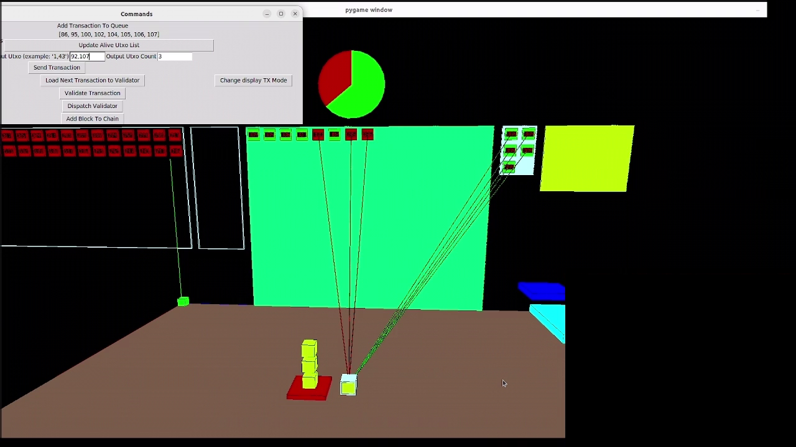

# 3D Utxo



# Overview
3D modelisation of certain aspects of a UTxO based blockchain, in particular Cardano.

# Installation
With python3 install the following dependencies, the usage of a venv is recommended.
```
sudo apt install python3-pip
sudo apt-get install python3-tk
pip3 install PyOpenGL
pip3 install pygame

```

# Usage
Check the file config.json and see if the values are good for your setup.
Run `python3 utxos.py` to run the 3D model
Run `python3 command_ui.py` in another terminal to the remote control.

In the 3D view use WASDZX+arrows for navigation. Also try with Space bar and Shift+Space bar

L will store the current camera, and M will jump over the different stored cameras
